# "Find Your People" App (Phase 1)

This mockup was modified from the Flutter Skeleton template app. Differences include:

* Elimination of the src/ directory
* Elimination of localization
  * deleted flutter_localization and generate: true from pubspec.yml.
  * deleted i10n.yml file
  * deleted locationization directory
* Eliminated restoration
* Addition of pages for various app functions

Here are screen shots that illustrate this mockup.

Click on any screen shot to see it full-size.

  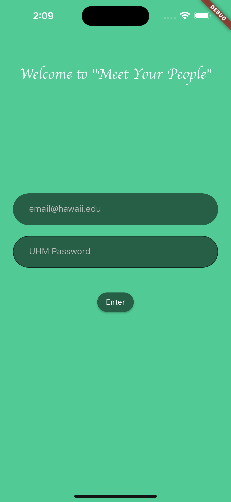
  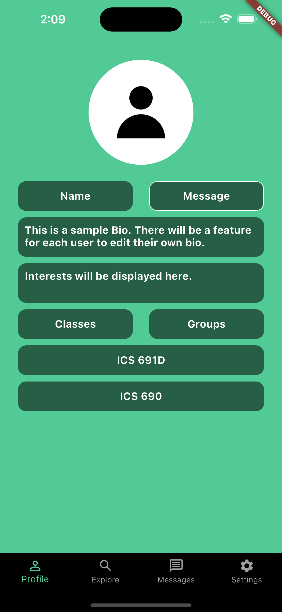
  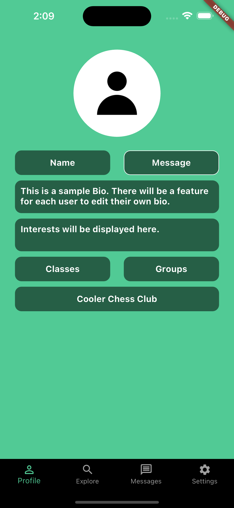
  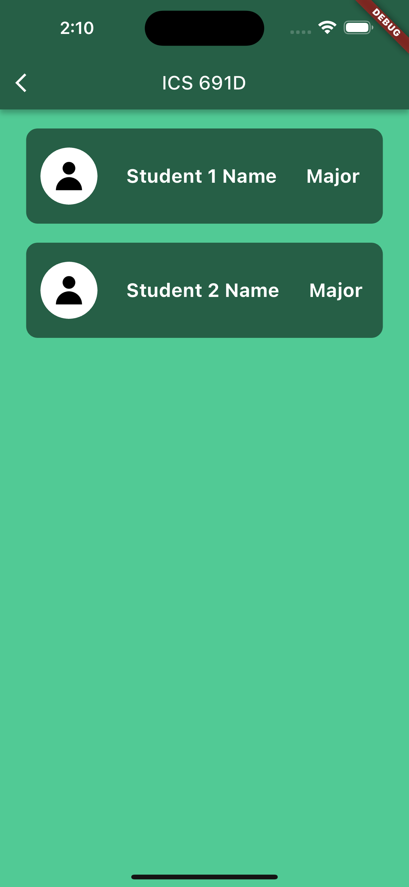
  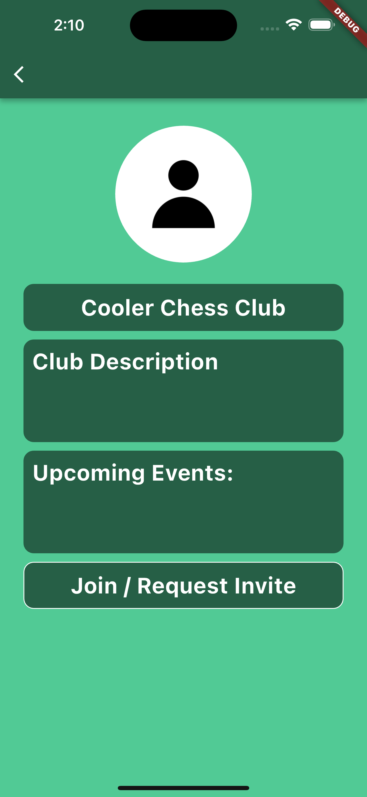
 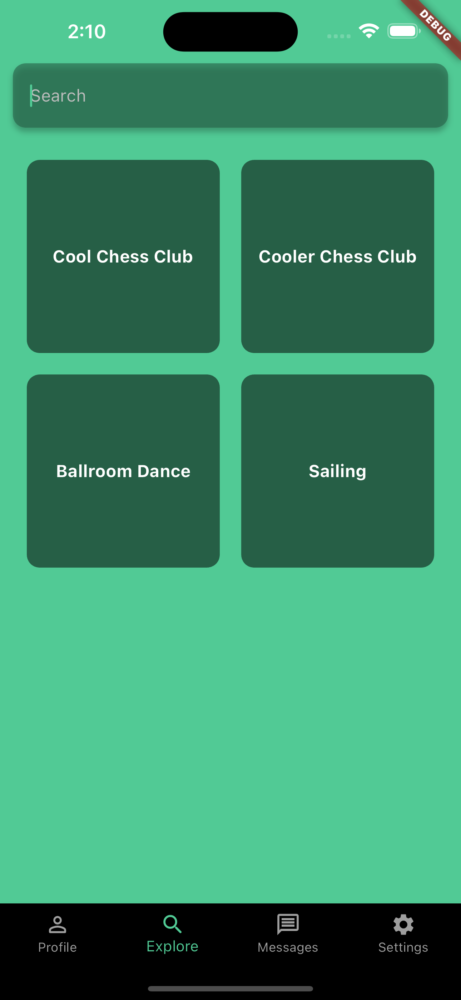
 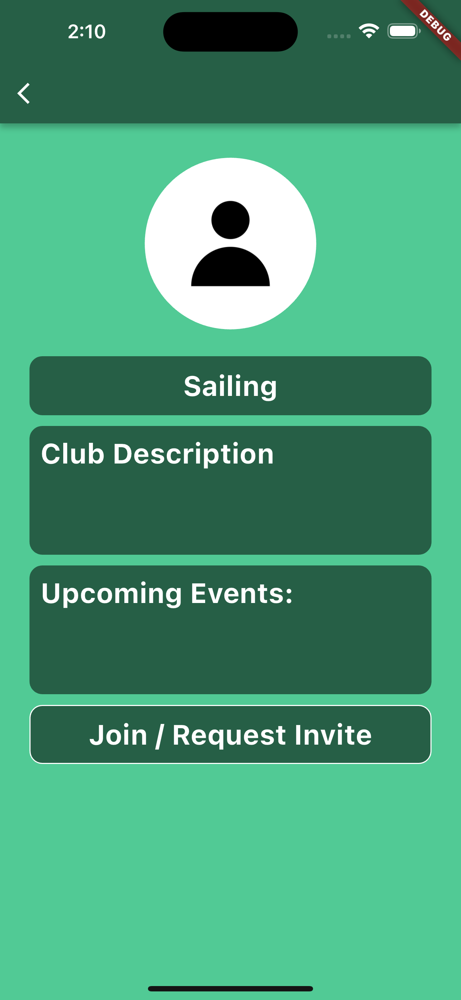
 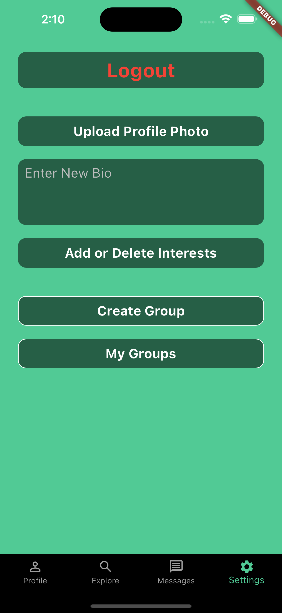
 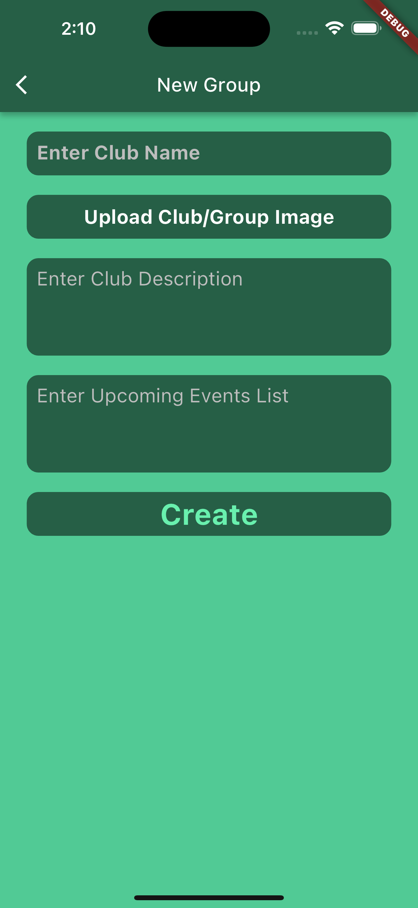
 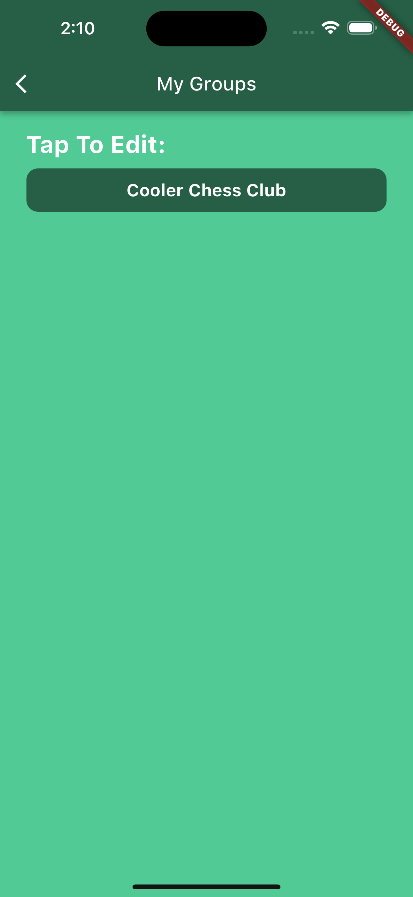
 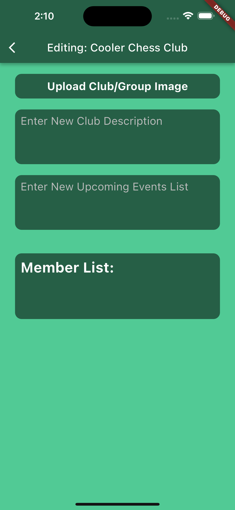

